# 🏗️ OpsPulse AI - System Architecture

> **Intelligent Real-Time Log Analysis & Automated Remediation**

This document provides comprehensive visual diagrams explaining the OpsPulse AI system architecture, data flows, and component interactions.

---

## 📑 Table of Contents

1. [High-Level System Architecture](#1-high-level-system-architecture)
2. [Data Flow Pipeline](#2-data-flow-pipeline)
3. [Log Generator Architecture](#3-log-generator-architecture)
4. [Anomaly State Machine](#4-anomaly-state-machine)
5. [RAG Pipeline Detail](#5-rag-pipeline-detail)
6. [Pathway Stream Processing](#6-pathway-stream-processing)
7. [Component Interaction Sequence](#7-component-interaction-sequence)
8. [Deployment Architecture](#8-deployment-architecture)
9. [Technology Stack](#9-technology-stack)
10. [Error Handling & Retry Flow](#10-error-handling--retry-flow)

---

## 1. High-Level System Architecture

> Overview of all major components and their interactions

```mermaid
flowchart TB
    subgraph Sources["📥 Data Sources"]
        LG[("🔄 Log Generator<br/>FastAPI Server")]
        EXT[("🌐 External Logs<br/>(Future)")]
    end

    subgraph MessageQueue["📨 Message Queue"]
        KAFKA[("☁️ Kafka/Redpanda<br/>Cloud Cluster")]
        RAW_TOPIC["📋 raw_logs topic"]
        ALERT_TOPIC["🚨 processed_alerts topic"]
    end

    subgraph Processing["⚙️ Stream Processing"]
        PATHWAY["🧠 Pathway Consumer<br/>- Parse & Enrich<br/>- Tumbling Windows<br/>- Anomaly Detection"]
    end

    subgraph Intelligence["🤖 AI Layer"]
        CHROMA[("🗄️ ChromaDB<br/>Vector Store")]
        GEMINI["💎 Gemini<br/>Embeddings"]
        DEEPSEEK["🔮 DeepSeek R1<br/>Reasoning LLM"]
    end

    subgraph Output["📤 Output"]
        ALERTS["🔔 Alert System"]
        SLACK["💬 Slack"]
        PAGER["📟 PagerDuty"]
    end

    LG -->|HTTP/WebSocket| PRODUCER["📤 Producer"]
    EXT -.->|Future| PRODUCER
    PRODUCER -->|Produce| RAW_TOPIC
    RAW_TOPIC --> KAFKA
    KAFKA --> PATHWAY
    PATHWAY -->|Anomaly Detected| ALERT_TOPIC
    PATHWAY -->|Query| RAG["🔍 RAG Pipeline"]
    RAG --> CHROMA
    RAG --> GEMINI
    RAG --> DEEPSEEK
    DEEPSEEK -->|Remediation| ALERTS
    ALERTS --> SLACK
    ALERTS --> PAGER

    style LG fill:#e1f5fe
    style KAFKA fill:#fff3e0
    style PATHWAY fill:#f3e5f5
    style DEEPSEEK fill:#e8f5e9
    style ALERTS fill:#ffebee
```



### Key Components

| Component | Technology | Purpose |
|-----------|------------|---------|
| **Log Generator** | FastAPI | Synthetic log generation with anomaly injection |
| **Message Queue** | Kafka/Redpanda | High-throughput log buffering |
| **Stream Processor** | Pathway | Real-time windowing & detection |
| **Vector Store** | ChromaDB | Runbook embeddings storage |
| **LLM** | DeepSeek R1 | Reasoning & remediation generation |

---

## 2. Data Flow Pipeline

> Step-by-step journey of a log from generation to alert


### Latency Breakdown

| Stage | Typical Latency |
|-------|-----------------|
| Generation → Kafka | ~10ms |
| Kafka → Consumer | ~50ms |
| Window Aggregation | 60 seconds |
| RAG Retrieval | ~500ms |
| LLM Generation | 5-30 seconds |
| **Total** | **~65 seconds** |

---

## 3. Log Generator Architecture

> Detailed view of the synthetic log generation system


### Log Level Distribution

```
INFO     ████████████████████████████████████████████████████████░░░░░  70%
DEBUG    ████████████░░░░░░░░░░░░░░░░░░░░░░░░░░░░░░░░░░░░░░░░░░░░░░░░░  15%
WARNING  ████████░░░░░░░░░░░░░░░░░░░░░░░░░░░░░░░░░░░░░░░░░░░░░░░░░░░░░  10%
ERROR    ███░░░░░░░░░░░░░░░░░░░░░░░░░░░░░░░░░░░░░░░░░░░░░░░░░░░░░░░░░░   4%
CRITICAL █░░░░░░░░░░░░░░░░░░░░░░░░░░░░░░░░░░░░░░░░░░░░░░░░░░░░░░░░░░░░   1%
```

---

## 4. Anomaly State Machine

> How anomalies progress through severity levels


### Anomaly Types Summary

| Type | Weight | Duration | Characteristics |
|------|--------|----------|-----------------|
| **Error Spike** | 25% | 20 logs | Sudden burst of ERROR/CRITICAL |
| **Latency Degradation** | 20% | 50 logs | Response times multiply 5x |
| **Security Threat** | 15% | Variable | Brute force, SQL injection, XSS |
| **Resource Exhaustion** | 15% | 20 logs | Memory/CPU/Disk climbing to 99% |
| **Service Outage** | 15% | 30 logs | 503 errors, connection failures |
| **Data Anomaly** | 10% | Variable | Null values, format errors |

---

## 5. RAG Pipeline Detail

> Retrieval-Augmented Generation for runbook-based remediation


### Embedding Configuration

| Parameter | Value | Rationale |
|-----------|-------|-----------|
| **Model** | Gemini text-embedding-004 | High quality, free tier |
| **Dimensions** | 3072 | Rich semantic representation |
| **Chunk Size** | 1000 chars | Balance context vs specificity |
| **Overlap** | 200 chars | Prevent info loss at boundaries |
| **Top-K** | 5 | Multiple relevant sources |

---

## 6. Pathway Stream Processing

> Real-time log processing with tumbling windows

```mermaid
flowchart TB
    subgraph Input["📥 Kafka Input"]
        KAFKA_READ["pw.io.kafka.read()"]
        SCHEMA["LogSchema Validation"]
    end

    subgraph Enrichment["🔧 Data Enrichment"]
        PARSE_TS["parse_timestamp()<br/>ISO → DateTimeNaive"]
        EXTRACT_LABELS["extract_anomaly_flag()<br/>extract_anomaly_type()<br/>extract_anomaly_score()"]
        COMPUTE["is_error_level()<br/>Computed Fields"]
    end

    subgraph Windowing["⏱️ Tumbling Window"]
        WINDOW["windowby()<br/>duration=1 minute"]
        REDUCE["reduce()<br/>- count()<br/>- sum(is_error)<br/>- sum(is_anomaly)<br/>- avg(response_time)"]
    end

    subgraph Detection["🚨 Anomaly Detection"]
        CALC_RATE["Calculate<br/>Error Rate"]
        CHECK_SPIKE{"Spike?<br/>anomaly_count > 0<br/>error_count >= 5<br/>error_rate > 0.1"}
        FLAG["Flag as Spike"]
    end

    subgraph Output["📤 Output"]
        FORMAT["format_alert()<br/>JSON Serialization"]
        KAFKA_WRITE["pw.io.kafka.write()<br/>processed_alerts"]
    end

    KAFKA_READ --> SCHEMA
    SCHEMA --> PARSE_TS
    PARSE_TS --> EXTRACT_LABELS
    EXTRACT_LABELS --> COMPUTE
    COMPUTE --> WINDOW
    WINDOW --> REDUCE
    REDUCE --> CALC_RATE
    CALC_RATE --> CHECK_SPIKE
    CHECK_SPIKE -->|Yes| FLAG
    CHECK_SPIKE -->|No| DISCARD["Discard"]
    FLAG --> FORMAT
    FORMAT --> KAFKA_WRITE

    style Input fill:#fff3e0
    style Enrichment fill:#e3f2fd
    style Windowing fill:#f3e5f5
    style Detection fill:#ffebee
    style Output fill:#e8f5e9
```



### Detection Thresholds

```python
# Spike Detection Criteria (any of):
anomaly_count > 0          # Ground truth from generator
error_count >= 5           # Absolute error threshold
error_rate > 0.1           # 10%+ of logs are errors

# Window Configuration:
WINDOW_DURATION = 1 minute  # Tumbling (non-overlapping)
SPIKE_THRESHOLD = 3.0       # Z-score (future use)
```

---

## 7. Component Interaction Sequence

> Timeline of a complete anomaly detection and remediation cycle

```mermaid
sequenceDiagram
    participant Gen as 🔄 Log Generator
    participant Prod as 📤 Producer
    participant Kafka as ☁️ Kafka
    participant Path as ⚙️ Pathway
    participant Chroma as 🗄️ ChromaDB
    participant Gemini as 💎 Gemini
    participant DS as 🔮 DeepSeek
    participant Alert as 🔔 Alerts

    Note over Gen,Alert: 🟢 Normal Operation Flow
    
    Gen->>Gen: Generate Log Entry
    Gen->>Gen: Check Anomaly Probability (5%)
    Gen->>Gen: Apply Anomaly Pattern
    Gen->>Prod: HTTP POST /api/generate
    Prod->>Kafka: Produce to raw_logs
    
    Kafka->>Path: Consume Message
    Path->>Path: Parse & Enrich Log
    Path->>Path: Add to Window Buffer
    
    Note over Path: ⏱️ Window Closes (1 min)
    
    Path->>Path: Aggregate Statistics
    Path->>Path: Detect Spike (error_rate > 10%)
    
    alt 🚨 Anomaly Detected
        Path->>Gemini: Embed Query
        Gemini-->>Path: Query Vector [3072]
        Path->>Chroma: Vector Similarity Search
        Chroma-->>Path: Top-5 Runbook Chunks
        Path->>DS: Generate with Context
        DS->>DS: Chain-of-Thought Reasoning
        DS-->>Path: Remediation Answer
        Path->>Alert: Send Alert + Fix
        Path->>Kafka: Produce to processed_alerts
    else ✅ Normal
        Path->>Path: Store Metric Only
    end
```



---

## 8. Deployment Architecture

> Infrastructure layout across cloud and local environments

```mermaid
flowchart TB
    subgraph GCP["☁️ Google Cloud Platform"]
        subgraph VM1["🖥️ VM: Log Generator<br/>e2-medium"]
            LG_SVC["opspulse-logs.service<br/>(systemd)"]
            LG_APP["FastAPI :8000"]
            LG_VENV["Python venv"]
        end
        
        subgraph VM2["🖥️ VM: DeepSeek LLM<br/>n1-standard-8 + T4"]
            DS_SVC["DeepSeek R1<br/>(Ollama/vLLM)"]
            DS_API[":8080 OpenAI-compatible"]
            GPU["🎮 NVIDIA T4 GPU"]
        end
    end

    subgraph Redpanda["☁️ Redpanda Cloud"]
        RP_CLUSTER["Cluster<br/>ap-south-1"]
        RP_TOPIC1["📋 raw_logs"]
        RP_TOPIC2["🚨 processed_alerts"]
    end

    subgraph Local["💻 Local Development"]
        PRODUCER["📤 Producer Client"]
        CONSUMER["⚙️ Pathway Consumer"]
        RAG["🔍 RAG Server<br/>(ChromaDB + Flask)"]
        CHROMA_DB[("🗄️ ChromaDB<br/>./chroma_db")]
    end

    subgraph External["🌐 External APIs"]
        GEMINI_API["💎 Gemini API<br/>(Embeddings)"]
    end

    LG_APP -->|"HTTPS :8000"| PRODUCER
    PRODUCER -->|"SASL_SSL :9092"| RP_CLUSTER
    RP_CLUSTER --> CONSUMER
    CONSUMER -->|"HTTP :5000"| RAG
    RAG --> CHROMA_DB
    RAG -->|"HTTPS"| GEMINI_API
    RAG -->|"HTTP :8080"| DS_API

    style GCP fill:#e3f2fd
    style Redpanda fill:#ffebee
    style Local fill:#e8f5e9
    style External fill:#fff3e0
```



### Infrastructure Costs (Estimated)

| Resource | Specification | Monthly Cost |
|----------|---------------|--------------|
| Log Generator VM | e2-medium (2 vCPU, 4GB) | ~$25 |
| DeepSeek LLM VM | n1-standard-8 + T4 GPU | ~$300 |
| Redpanda Cloud | Starter tier | Free |
| Gemini API | Free tier | $0 |
| **Total** | | **~$325/month** |

---

## 9. Technology Stack

> Complete technology mindmap

```mermaid
mindmap
    root((🚀 OpsPulse AI))
        ⚡ Stream Processing
            Pathway
            Kafka/Redpanda
            Tumbling Windows
            Z-Score Detection
        🤖 AI/ML
            Gemini Embeddings
            DeepSeek R1 LLM
            ChromaDB Vectors
            LiteLLM Abstraction
        🔧 Backend
            Python 3.10+
            FastAPI
            Flask
            Pydantic
            httpx
        📊 Data Generation
            Faker
            NumPy
            Dataclasses
            YAML Config
        🏗️ Infrastructure
            GCP VMs
            Docker
            systemd
            SASL/SSL Auth
        🔮 Future
            Streamlit Dashboard
            Slack Webhooks
            PagerDuty Integration
            Auto-Remediation
```



### Package Dependencies

```
┌─────────────────────────────────────────────────────────────┐
│ Core                                                        │
├─────────────────────────────────────────────────────────────┤
│ pathway          │ Stream processing engine                 │
│ confluent-kafka  │ Kafka producer/consumer                  │
│ chromadb         │ Vector database                          │
│ litellm          │ LLM abstraction layer                    │
├─────────────────────────────────────────────────────────────┤
│ API                                                         │
├─────────────────────────────────────────────────────────────┤
│ fastapi          │ REST API framework                       │
│ flask            │ RAG server                               │
│ uvicorn          │ ASGI server                              │
│ pydantic         │ Data validation                          │
├─────────────────────────────────────────────────────────────┤
│ Data Processing                                             │
├─────────────────────────────────────────────────────────────┤
│ pdfplumber       │ PDF text extraction                      │
│ faker            │ Synthetic data generation                │
│ numpy            │ Numerical operations                     │
│ pyyaml           │ Configuration parsing                    │
└─────────────────────────────────────────────────────────────┘
```

---

## 10. Error Handling & Retry Flow

> Resilience patterns across the system

```mermaid
flowchart TD
    subgraph Producer["📤 Producer Error Handling"]
        P_FETCH["Fetch Logs from Server"]
        P_FETCH -->|Success| P_SEND["Send to Kafka"]
        P_FETCH -->|Timeout| P_RETRY{"Retry<br/>< 3?"}
        P_RETRY -->|Yes| P_WAIT["Wait 2s"] --> P_FETCH
        P_RETRY -->|No| P_FAIL["Log Error, Continue"]
        
        P_SEND -->|Delivery Failed| P_REPORT["delivery_report()"]
        P_SEND -->|Success| P_STATS["Update Stats"]
    end

    subgraph Consumer["⚙️ Pathway Consumer"]
        C_READ["Read from Kafka"]
        C_READ -->|Parse Error| C_DEFAULT["Use Default Values"]
        C_READ -->|Success| C_PROCESS["Process Log"]
        C_DEFAULT --> C_PROCESS
    end

    subgraph RAG["🔍 RAG Error Handling"]
        R_EMBED["Get Embedding"]
        R_EMBED -->|API Error| R_CACHE["Check Cache"]
        R_EMBED -->|Success| R_SEARCH["Vector Search"]
        R_SEARCH -->|No Results| R_FALLBACK["Generic Response"]
        R_SEARCH -->|Success| R_LLM["Query LLM"]
        R_LLM -->|Timeout 5min| R_CHUNK["Return Chunks Only"]
        R_LLM -->|Success| R_RESPONSE["Full Response"]
    end

    style Producer fill:#fff3e0
    style Consumer fill:#e3f2fd
    style RAG fill:#e8f5e9
```



### Failure Modes & Recovery

| Component | Failure Mode | Recovery Strategy |
|-----------|--------------|-------------------|
| **Kafka** | Connection lost | Auto-reconnect with backoff |
| **Producer** | HTTP timeout | 3 retries, 2s delay |
| **Consumer** | Parse error | Default values, continue |
| **Gemini API** | Rate limit | Exponential backoff |
| **DeepSeek** | Timeout (5min) | Return raw chunks |
| **ChromaDB** | Empty results | Generic fallback response |

---

## 📝 Quick Reference

### Starting the System

```bash
# 1. Start Log Generator (GCP VM)
sudo systemctl start opspulse-logs

# 2. Start Producer (Local)
cd Message_queue_kafka
python producer.py --continuous --interval 1.0

# 3. Start Pathway Consumer (Local)
python pathway_consumer.py

# 4. Start RAG Server (Local)
cd Rag
python chroma_rag_server.py
```

### Key Endpoints

| Service | Endpoint | Purpose |
|---------|----------|---------|
| Log Generator | `GET /api/health` | Health check |
| Log Generator | `POST /api/generate` | Generate batch |
| Log Generator | `WS /ws/logs` | Stream logs |
| RAG Server | `POST /query` | Ask question |
| DeepSeek | `POST /v1/chat/completions` | LLM inference |

---

## 🎯 Summary

OpsPulse AI transforms passive log monitoring into **intelligent, actionable alerts** by combining:

1. **Real-time streaming** with Pathway tumbling windows
2. **Intelligent detection** via statistical anomaly analysis
3. **Contextual remediation** through RAG-powered runbook retrieval
4. **Transparent reasoning** with DeepSeek R1's chain-of-thought

**Result:** Reduce MTTR by delivering the problem AND the solution together.

---

<div align="center">

**Built with ❤️ for the AIOps revolution**

*OpsPulse AI - Turning 3 AM pages into 3-second fixes*

</div>
